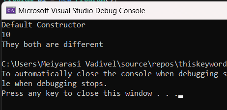

# Operator-Overloading

## Aim:
 To write a C# program to pass values through constructors(default and parameterized) and also overload equal operators by checking whether objects are equal using operator overloading. 
 
 ## Algorithm:
 ### step 1: 
 Create a class for operator overloading.
 ### step2:
 Get inputs for length,breadth from the user in overloading function
 ### step 3:
Compare the inputs such as length and breadth.
### step 4:
Using equal to(==) and not equal to(!=) operator we can compare the inputs.
 
 ## Program:
 ~~~
 Developed by : Meiyarasi.V
 Register number : 212221230058
 ~~~
 ~~~
 using OperOverload;
    using System;
namespace OperOverload
{
    class Program
    {
        int n;
        public Program()
        {
            Console.WriteLine("Default Constructor");
        }
        public Program(int n)
        {
            Console.WriteLine(n);
        }
        public static bool operator ==(Program p1, Program p2)
        {
            return p1.Equals(p2);

        }
        public static bool operator !=(Program p1, Program p2)
        {
            return !p1.Equals(p2);

        }

    }
    class Example
    {
        public static void Main()
        {
            Program p1 = new Program();
            Program p2 = new Program(10);
            if (p1 == p2)
            {
                Console.WriteLine("Object are Equal");
            }
            else
            {
                Console.WriteLine("They both are different ");
            }
        }
    }
}

~~~
 
 ## Output:
 
 

 ## Result:
 C# program using operator overloading is implemented successfully.
